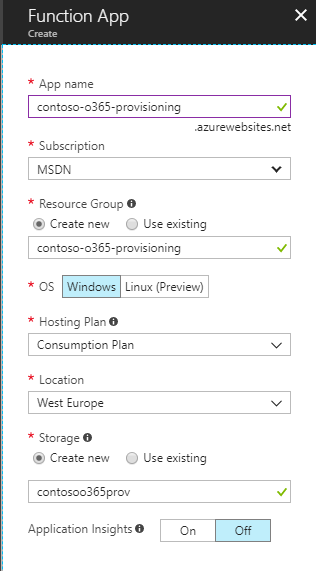

# Puzzlepart Office 365 Azure Functions 

Version: 1
Contributors: Mikael Svenson

# 1       Architecture

## 1.1       Azure Functions

Puzzlepart's recommended approach is to run Azure Functions on a consumption plan where you are billed per each run of a function. The price per run is very low and as creating new Office 365 Groups is not a frequent operation the run cost per month on a consumption plan is fairly low.

When running on the consumption plan each Azure function can use a maximum of 5 minutes per operation. In our modularized approach to provisioning and configuring Office 365 Groups this fits very well and is not a blocking limit.

## 1.2       Programming language and API's

Azure Functions can be written in numerous programming languages. We have chosen C# to utilize SharePoint PnP for SharePoint communication and use of the Microsoft Graph .Net SDK for Microsoft Graph communication.

In order to effectively consume Azure Functions in Microsoft Flow you need to generate a swagger definition which declaratively describes the function API. By default the swagger generation in Azure is lacking and by using C# we can automatically generate the swagger definition. This means there is no manual work as new functions are added.

## 1.3       ADAL application

Azure Functions communicate with Office 365 thru two API's. SharePoint CSOM and Microsoft Graph REST. In order to call these API's you have to establish an ADAL application which provides the necessary access rights with app-only permissions.

In addition to an ADAL app key/secret pair you have to add a certificate for access to SharePoint. The recommended practice is to set the key to never expire and set the certificate to expire in 20 years. You should also establish procedures for potentially changing the key and certificate on a schedule.

# 2       Setup

## 2.1       ADAL Application

An ADAL application is created under the Azure Active Directory blade in the Azure portal.

### 2.1.1       Setup

**Name:** <give the app a senible name>
**Application Type:** Web app / API
**Sign-on URL:** https://<tenant>.sharepoint.com/provisioning (or another fqdn).

#### Application permissions

Add the minimum of application-only permissions to the ADAL app. If you want to configure other resources for the Office 365 Group during provisioning you have to add the additional applicable permissions.

| API                          | Permissions                              |
| ---------------------------- | ---------------------------------------- |
| Microsoft Graph              | Directory.ReadWrite.All  Group.ReadWrite.All |
| Office 365 SharePoint Online | Sites.FullControl.All                    |

**Note:** After saving the set permissions it's important to click the *Grant Permissions* button to make them available.

### 2.1.2       Secrets

todo

### 2.1.3       Certificate and manifest

todo

## 2.2       Azure Function App

Create an Azure Function App as stated in 1.1.

### 2.2.1       Application settings

Under application settings for the function app set the following application setting variables. The URI for Azure Key Vault comes from the next step.

| Name        | Value                                  |
| ----------- | -------------------------------------- |
| KeyVaultUri | https://<keyvaultname>.vault.azure.net |
| ADALDomain  | <tenant>.onmicrosoft.com               |

### 2.2.2       Managed service identity

In order to easily communicate between Azure Key Vault and Azure Functions we utilize the feature of managed service identities. This is a service account for this one Function App, and allows ease of setup between services without having to create our own service accounts in Azure AD.

Navigate to platform feature for the Azure Function App and chose *Managed service identity*. Choose to integrate with Azure Active Directory and save. The name of the service identity will match that of the Azure Function App.

## 2.3       Azure Key Vault

In order to protect the ADAL app secret and certificate Puzzlepart recommend storing these values in Azure Key Vault. This ensures that only people with access to key vault can read the values.

Once the key vault is created make a note of DNS name which is to be added to the Azure Function application settings in 2.2.1.

### 2.3.1       Access policies

Navigate to the Access policy setting for the key vault and click *Add new*. Under *Select principal* search up the name of your Azure Function App. Grant the principal  the following access and save.

| Name               | Value |
| ------------------ | ----- |
| Secret permissions | Get   |

### 2.3.2       Secrets

Add the following four secrets of type *Manual* which you created in step 2.1.

| Name                  | Value                                    |
| --------------------- | ---------------------------------------- |
| ADALAppCertificateKey | -----BEGIN RSA PRIVATE  KEY-----MIIEpAIB…. |
| ADALAppCertificate    | -----BEGIN  CERTIFICATE-----MIIDpzCCAo+gA… |
| ADALAppId             | <ADAL App Id>                            |
| ADALAppSecret         | tLw1bhSm….                               |

## 2.4       Flow

### 2.4.1       Connections

